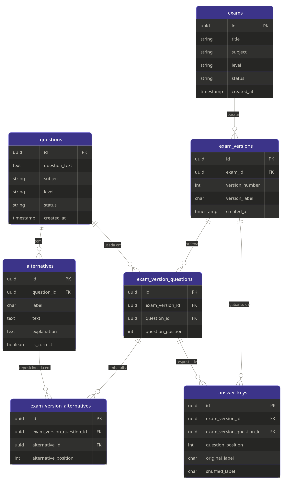
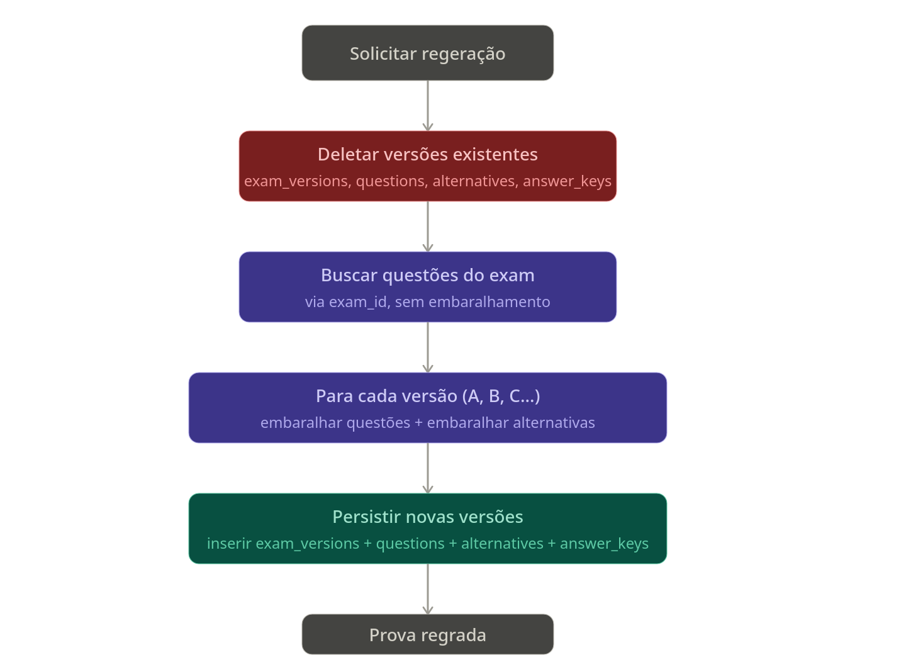
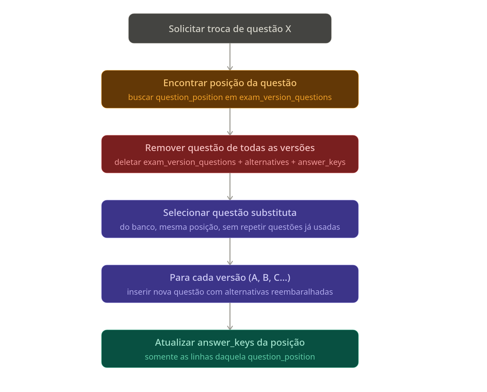
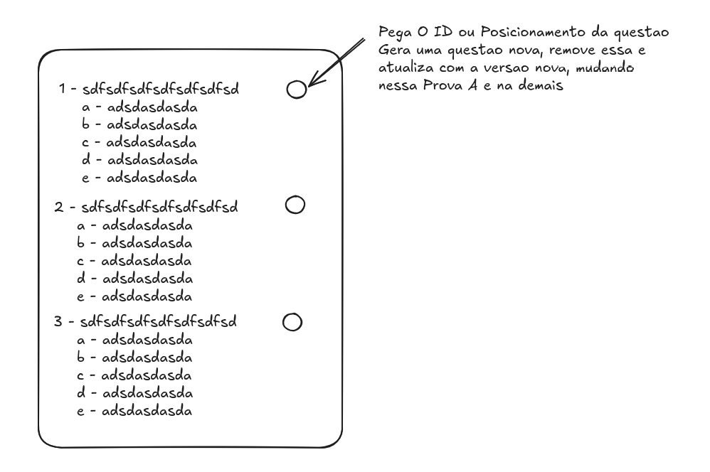

## Logica de banco de dados e gereação de provas, versoes e gabaritos

### 1. Visão geral

Boa simplificação. Vou refazer focado só no essencial.A lógica central está em três camadas:

**Questões são imutáveis.** `questions` e `alternatives` guardam o conteúdo original exatamente como veio do NotebookLM, com os labels originais (A, B, C, D, E) e a flag `is_correct`. Você nunca mexe nessas tabelas ao gerar provas.

**Versões são o embaralhamento.** Cada prova tem N versões (mínimo 2). `exam_version_questions` define a ordem das questões naquela versão via `question_position`. `exam_version_alternatives` define a ordem das alternativas daquela questão naquela versão via `alternative_position`. O `version_label` pode ser A, B, C... ou 1, 2, 3... como você preferir nomear para o aluno.

**Gabarito rastreia a transformação.** `answer_keys` é a parte mais importante: para cada questão em cada versão, ela guarda tanto o `original_label` (qual era a letra correta no banco original) quanto o `shuffled_label` (qual ficou sendo a letra correta depois do embaralhamento). Então o gabarito da versão B de uma prova é só um SELECT na `answer_keys` pelo `exam_version_id`, ordenado por `question_position`.

Um exemplo concreto: a questão 3 do banco tem a alternativa C como correta. Na versão A da prova essa questão ficou na posição 7, e depois do embaralhamento das alternativas a opção correta virou a letra B. O `answer_keys` registra `question_position=7, original_label=C, shuffled_label=B`.

---

## Vamos usar o seguinte cenario, preciso regerar a prova completa ou apenas uma questao daquela prova como seria?  Teria alguma mudanca no banco ou apenas na logica do back?

É só lógica de back-end, o schema não muda. Mas deixa eu mostrar os dois cenários:Dois fluxos bem distintos. Vou mostrar cada um separado.

O ponto chave aqui: você deleta apenas as exam_versions e tudo que depende delas em cascata (via ON DELETE CASCADE no banco). A tabela exams em si e as questions originais ficam intactas — só o embaralhamento é descartado e refeito.
Agora o fluxo de substituição de uma única questão:

A diferença central entre os dois fluxos:
Na regeração completa você está substituindo tudo que está "abaixo" de exams — é uma operação nuclear que aproveita o ON DELETE CASCADE. O exam_id continua o mesmo, só as versões mudam.
Na substituição de questão você é cirúrgico: a posição da questão na prova é preservada em todas as versões, só o conteúdo naquela posição muda. O cuidado extra aqui é garantir que a questão substituta não esteja já sendo usada em outra posição da mesma prova — um simples NOT IN (SELECT question_id FROM exam_version_questions WHERE exam_version_id IN (...)) resolve.
Um detalhe importante: nas duas operações as alternativas são sempre reembaralhadas do zero. Nunca reutilize o embaralhamento anterior, pois o aluno poderia perceber o padrão entre versões.

---

## Ideia de como vai funcionar no front

